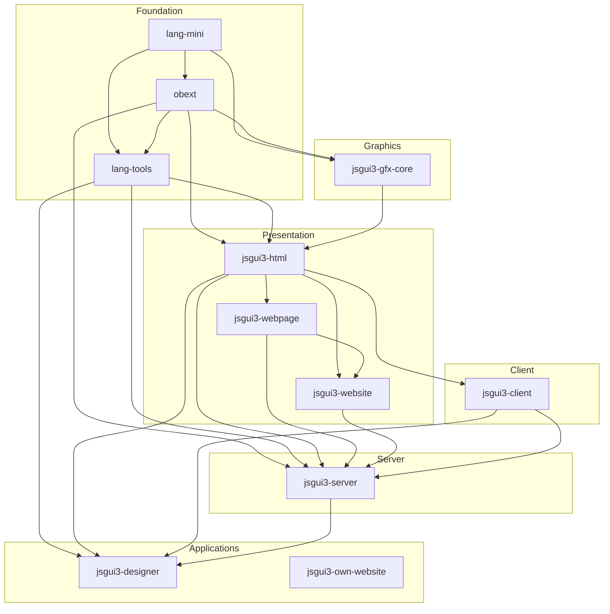

# jsgui3 Ecosystem — Architecture

> **Last Updated:** 2026-05-28

## Architectural Layers

The jsgui3 ecosystem is organised into five architectural layers, each building upon the one below it.

```
┌──────────────────────────────────────────────────────────────────┐
│  Layer 5: Applications                                           │
│  ┌────────────────────┐  ┌────────────────────┐                  │
│  │ jsgui3-designer    │  │ jsgui3-own-website │   (user apps)    │
│  └────────────────────┘  └────────────────────┘                  │
├──────────────────────────────────────────────────────────────────┤
│  Layer 4: Server                                                 │
│  ┌──────────────────────────────────────────────────────┐        │
│  │ jsgui3-server                                        │        │
│  │  HTTP serving · bundling · SSE · admin UI · CLI      │        │
│  └──────────────────────────────────────────────────────┘        │
├──────────────────────────────────────────────────────────────────┤
│  Layer 3: Client                                                 │
│  ┌──────────────────────────────────────────────────────┐        │
│  │ jsgui3-client                                        │        │
│  │  HTTP helpers · client resources · page context       │        │
│  └──────────────────────────────────────────────────────┘        │
├──────────────────────────────────────────────────────────────────┤
│  Layer 2: Presentation                                           │
│  ┌─────────────────┐  ┌──────────────┐  ┌──────────────┐        │
│  │ jsgui3-html     │  │ jsgui3-      │  │ jsgui3-      │        │
│  │ Controls, MVVM, │  │ webpage      │  │ website      │        │
│  │ mixins, themes  │  │ Page model   │  │ Site model   │        │
│  └─────────────────┘  └──────────────┘  └──────────────┘        │
│  ┌─────────────────┐                                             │
│  │ jsgui3-gfx-core │                                             │
│  │ Pixel buffers   │                                             │
│  └─────────────────┘                                             │
├──────────────────────────────────────────────────────────────────┤
│  Layer 1: Foundation                                             │
│  ┌────────────┐  ┌────────────┐  ┌────────────┐                 │
│  │ lang-mini  │  │ obext      │  │ lang-tools │                 │
│  │ Events,    │  │ Reactive   │  │ Data models│                 │
│  │ types,     │  │ properties │  │ Collections│                 │
│  │ utilities  │  │            │  │ Vectors    │                 │
│  └────────────┘  └────────────┘  └────────────┘                 │
└──────────────────────────────────────────────────────────────────┘
```

---

## Dependency Graph



---

## Key Architectural Patterns

### 1. Isomorphic Control Lifecycle

Controls run on both server and client with a defined lifecycle:

```
Construction → Composition → Rendering (server) → Activation (client)
```

- **Construction:** `spec` config is processed; `__type_name` set; `super(spec)` called
- **Composition:** Child controls assembled via `this.add()`; UI tree built
- **Rendering:** `all_html_render()` generates HTML string with `data-jsgui-*` attributes
- **Activation:** `activate()` binds event listeners to existing DOM; client-only code runs here

### 2. MVVM Data Binding

Controls separate data from presentation:

```
Data_Object (data model)
    ↕  change events
Control (view)
    ↕  user interactions
Data_Object (view model)
```

- `Data_Object` instances emit `change` events on mutation
- Controls bind to models and update views automatically
- Multiple controls can share the same `Data_Object` for synchronisation

### 3. Reactive Property System

Built on `obext`:

```
prop(obj, name, default, callback)  →  closure storage + change events
field(obj, name, default)           →  obj._ storage + serialisable
```

This flows through:
- `lang-mini` provides `Evented_Class` and `eventify`
- `obext` adds `prop`/`field`/`read_only`/`get_set`
- `lang-tools` builds `Data_Value`/`Data_Object`/`Collection` on top
- `jsgui3-html` uses these for control state management

### 4. Mixin Composition

Controls gain behaviour through composable mixins:

```javascript
selectable(this, null, { multi: true });
collapsible(this, { trigger: '.header', content: '.children' });
```

- 39 mixins in 7 categories
- Auto-resolve dependencies (e.g., `pressed-state` applies `press-events`)
- Disposable cleanup via `create_mixin_cleanup()`
- Double-apply guard via `ctrl.__mx` registry

### 5. Server Bundling Pipeline

```
Client Source (.js)
    → esbuild transpilation
    → Control elimination (tree shaking)
    → CSS extraction from control classes
    → Bundle served to browser
    → Activation script activates SSR HTML
```

### 6. Event Architecture

Events flow through a hierarchical system:

```
DOM Event → Control Event → Parent Control → Context
                ↓
         Data Model Change → Bound Controls Update
```

- `Evented_Class` provides `.on()` / `.raise()`
- DOM events auto-mapped to control events
- Custom events bubble up the control tree
- Context coordinates cross-control communication

---

## Cross-Cutting Concerns

### Naming Conventions

| Scope | Convention | Example |
|-------|-----------|---------|
| Variables, methods | `snake_case` | `get_value`, `current_page` |
| Classes | `Camel_Case` (with underscores) | `Data_Model_View_Model_Control` |
| File names | `snake_case` | `form_field.js` |
| CSS classes | `kebab-case` | `form-field` |
| Constants | `SCREAMING_SNAKE_CASE` | `MAX_HISTORY_SIZE` |

### SSR Safety

All controls must guard DOM access for server compatibility:

```javascript
// ✅ Safe
if (this.input.dom.el) {
    this.input.dom.el.value = initial_value;
}

// ❌ Crashes on server
this.input.dom.el.value = initial_value;
```

### Context System

The `context` object is central to jsgui3:
- Tracks all controls for lifecycle management
- Routes events between controls
- Manages ID generation and registration
- Handles cleanup and memory management
